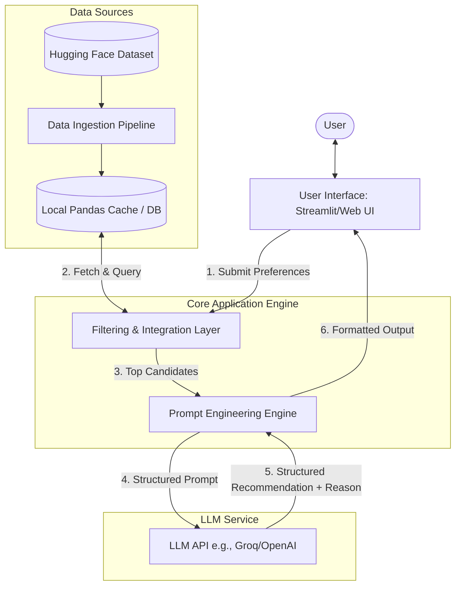
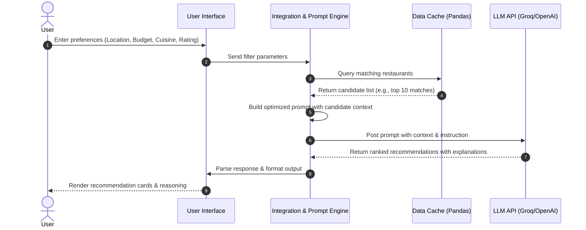

# System Architecture: AI-Powered Restaurant Recommendation System

This document outlines the detailed system architecture, component design, data flow, and technology choices for the AI-Powered Restaurant Recommendation System.

---

## 🏛️ System Architecture Overview

The application follows a modular architecture consisting of five distinct layers:
1. **User Interface (UI) / Presentation Layer**
2. **Filtering & Preprocessing Layer**
3. **Data Ingestion & Storage Layer**
4. **LLM Reasoning & Recommendation Layer**
5. **API & Integration Layer**

### High-Level Architecture Diagram

---

## 🔄 Data Flow & Sequence

Below is the sequence of actions starting from user interaction to final recommendation display.

---

## 🧩 Component Breakdown

### 1. Data Ingestion Pipeline
* **Responsibility:** Load and sanitize the restaurant dataset.
* **Details:**
  * Connects to [Hugging Face: ManikaSaini/zomato-restaurant-recommendation](https://huggingface.co/datasets/ManikaSaini/zomato-restaurant-recommendation).
  * Cleans missing values (e.g., handles missing cuisines, filters invalid ratings).
  * Normalizes the "Cost" attribute (e.g., converting "Cost for Two" strings into clean numeric values).
  * Stores data in a local cache (e.g., `pandas.DataFrame` or lightweight SQLite) for quick retrieval.

### 2. Filtering & Integration Layer
* **Responsibility:** Reduce the search space of the dataset to ensure the LLM receives highly relevant context within its token limits.
* **Logic:**
  * **Location Filter:** Match user-specified city/area.
  * **Cuisine Filter:** Match requested cuisines (e.g., Italian, Chinese).
  * **Budget Filter:** Map average cost into category thresholds (Low, Medium, High).
  * **Rating Filter:** Filter out restaurants below the minimum rating.
  * Selection of top candidates (e.g., top 5-10 based on rating/review count) to pass to the LLM.

### 3. Prompt Engineering & LLM Engine
* **Responsibility:** Compose instructions for the LLM to analyze, rank, and explain recommendation choices.
* **Prompt Strategy (System Instructions):**
  * Define the LLM's persona as an *"Expert Gastronomy Guide"*.
  * Inject the filtered restaurant candidates as structured JSON or markdown tables.
  * Enforce structured output generation (e.g., JSON or Markdown with specific headers).
  * Ask the LLM to justify **why** a restaurant fits the user's optional preferences (e.g., "Good for family", "Quick bite").

### 4. UI / Presentation Layer
* **Responsibility:** Capture user options and display output cleanly.
* **Features:**
  * Search sliders and multi-select dropdowns.
  * Visual cards showing:
    * Restaurant Name (bold, highlighted)
    * Average Cost, Rating, and Cuisine tags
    * A custom AI recommendation reason block.

---

## 🛠️ Technology Stack Recommendation

| Component | Technology / Library | Rationale |
| :--- | :--- | :--- |
| **Frontend/Web App** | Python Streamlit | Fast prototyping, built-in interactive components, excellent for data apps. |
| **Data Handling** | Pandas / Hugging Face Datasets | Streamlined API to fetch, filter, and transform tabular dataset attributes. |
| **LLM Orchestration** | LangChain / Groq Python SDK | Out-of-the-box support for structured outputs and prompt management. |
| **LLM Model** | Groq Llama 3.3 70B Versatile | Ultra-low-latency LPU inference, high token limits, and strong reasoning capabilities. |

---

## 🚀 Future Enhancements

* **Vector Search / RAG:** If reviews/descriptions are text-heavy, we can implement semantic search using embedding models (e.g., ChromaDB/FAISS) instead of plain SQL/pandas filtering.
* **Location-Based Geo-distance:** Incorporate coordinates to recommend restaurants closest to the user's current GPS location.
* **Conversational Chatbot:** Transition from a static form UI to a conversational agent that clarifies preferences dynamically.
